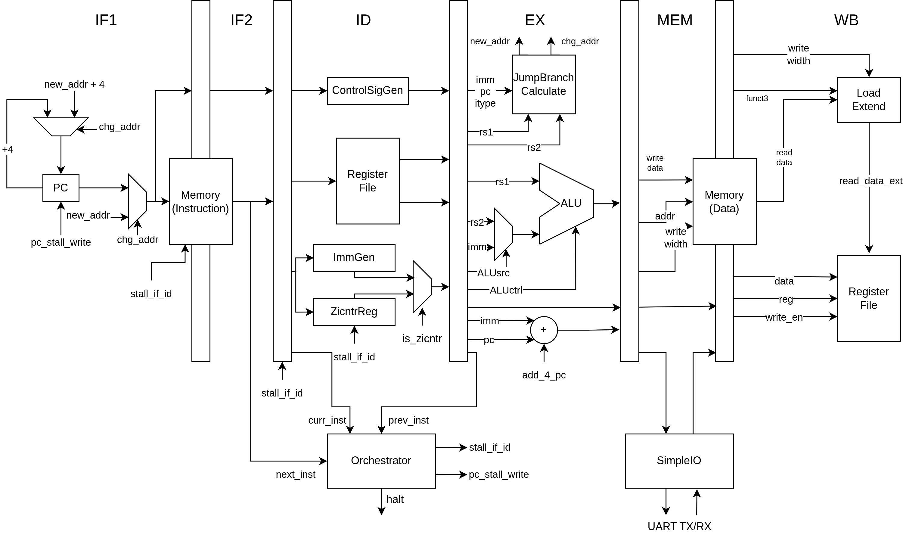
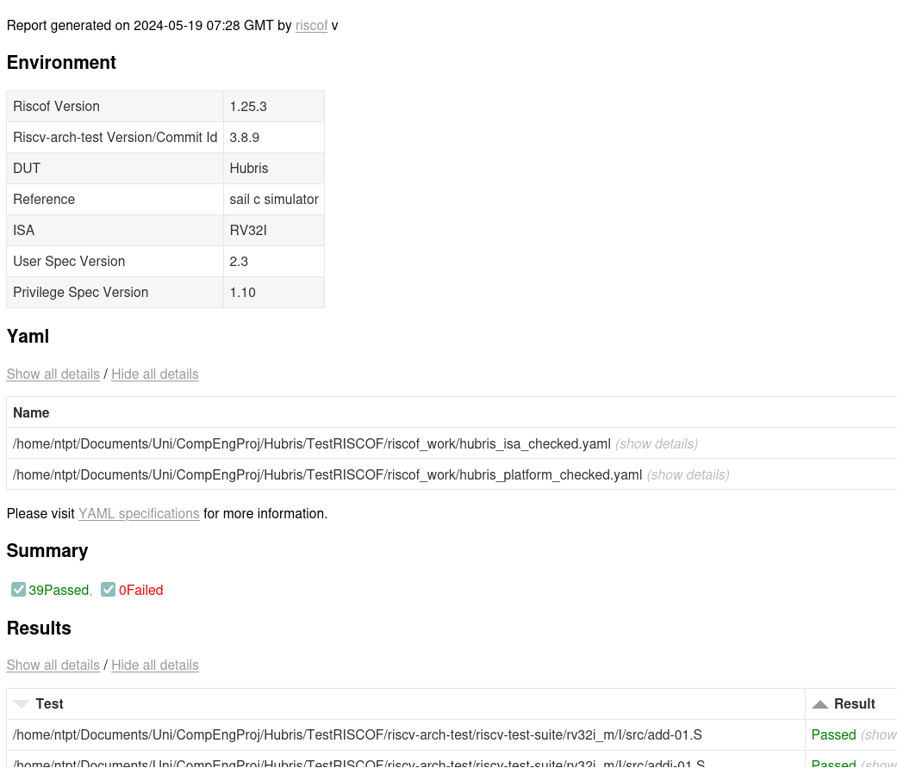
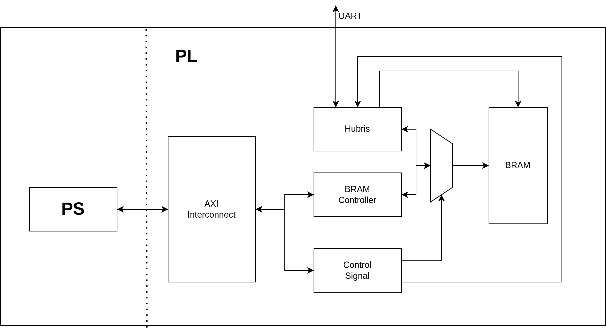

# Project statement

Within this project, student perform research and FPGA implementation of a RISC processing core
based on RISC-V ISA. From the results of implementation, student will perform validation and
performance testing for the core.

Objectives:

- Learn about the RISC-V-based processor model.
- Implementation of the processor using Verilog/SystemVerilog
- Propose validation method, perform validation
- Performance testing for the core through benchmarks

# Background

## RISC-V [@spec:riscv-isa-unpriv; @spec:riscv-isa-priv]

:::::::::::::: {.columns align=center .onlytextwidth}

::: {.column width="40%"}

{width=100%}

:::

::: {.column width="60%"}

- RISC-V is an *open standard* with *royalty-free open-source licenses* RISC ISA
- A RISC-V ISA is defined as a base integer ISA, which must be present in any implementation, plus
optional extensions to the base ISA.
    - Currently, there are 4 ratified base ISA: `RV32I`, `RV32E`, `RV64I`, `RV64E`
    - Many extensions: multiply/divide, floating point, SIMD, atomic, ...
- RISC-V defines three privileges level: User (U), Supervisor (S), Machine (M)
    - Different modes allow program access to different facilities of the processor

:::

::::::::::::::

## EBAZ4205 - development board

:::::::::::::: {.columns align=center .onlytextwidth}

::: {.column width="55%"}

*EBAZ4205*:

- Attractive pricing (~1mil VND), used as personal tinkering and learning tool
- Zynq 7010 SoC
- PL will be used to implement design
- PS can help in porting the design to hardware

![Simplified model of the Zynq architecture [@book:the-zynq-book] \label{fig:zynq-model}](image/zynq_simple_model.png){height=25%}

:::

::: {.column width="45%"}

![EBAZ4205 front side PCB image [@gh:ebaz4205] \label{fig:ebaz4205-closeup}](image/EBAZ4205_PCB.jpg){height=75%}

:::

::::::::::::::

## Related work

:::::::::::::: {.columns align=top .onlytextwidth}

::: {.column width="33%"}

PicoRV32 [@gh:picorv32]

- Designed to be small with high maximum frequency (not performance)
- Configurable to RV32I\[M\]\[C\]
- With dual port register, 1 cycle memory access
    - 0.516 DMIPS/MHz (908 Dhrystones/Second/MHz)
    - Average CPI is 4.100 (Dhrystone)

:::

::: {.column width="33%"}

NEORV32 [@gh:neorv32]

- "is a customizable microcontroller-like system on chip (SoC) built around the NEORV32 RISC-V CPU
that is written in platform-independent VHDL" - full system
- For "small" configuration (`rv32i_Zicsr_Zifencei`): 0.3389 CoreMarks/MHz, 4.04 CPI

:::

::: {.column width="33%"}

VexRiscv [@gh:VexRiscv]

- a RISC-V implementation written in SpinalHDL, optimized for FPGA
- RV32I\[M\]\[A\]\[F\[D\]\]\[C\]
- VexRiscv small and productive (RV32I, 0.82 DMIPS/Mhz)
- VexRiscv full no cache (RV32IM, 1.21 DMIPS/Mhz 2.30 Coremark/Mhz)

:::

::::::::::::::

---

:::::::::::::: {.columns align=top .onlytextwidth}

::: {.column width="50%"}

![Achieved frequency of various cores selected in the paper [@paper:softcore-catalog] \label{fig:paper-catalog-freq}](./image/catalog-freq-result.png){width=100%}

:::

::: {.column width="50%"}

![Dhrystone result of various cores selected in the paper [@paper:softcore-catalog] \label{fig:paper-catalog-dhrystone}](./image/catalog-dhrystone-result.png){width=100%}

:::

::::::::::::::

---

![Resource utilization of the three RISC- V based designs in terms of Look-Up Tables (LUTs), Flip- Flops (FFs), Block RAMs (BRAMs), Digital Signal Processing Blocks (DSPs), Mixed-Mode Clock Managers (MMCMs) and number of used IO pins (IOs) as well as the clock frequency of the designs (the numbers in brackets point to the resources of the CPU core only) [@paper:riscv-core-overview-evaluation] \label{fig:paper-overview-evaluation-result}](./image/paper-riscv-core-overview-evaluation-result.png){width=100%}

# Design

## Design scope

:::::::::::::: {.columns align=top .onlytextwidth}

::: {.column width="50%"}

*ISA scope*:

- `RV32I` base instruction set, but skip `FENCE`, `ECALL` and `EBREAK` instruction
- No privilege level, every thing run in "machine mode"
- No exception or trap. Only exception is the invalid instruction exception, which halt execution
and activate halt signal
- No memory misaligned access (assumed to never happen), simple memory access (in-order, 1 clock
cycle read/write)
- Support `Zicntr` (as a hack) for performance benchmarking

:::

::: {.column width="50%"}

*Architectural*:

- 6-stage pipeline architecture
    - instruction fetch (IF1 + IF2), instruction decode (ID), execution (EX), memory operation (MEM)
    and write back (WB)
- Single-issue, in-order execution
- Simple memory hierarchy (no cache, TLB), memory accessed by 2 port (instruction read + data)
- Idea of pipeline design comes from VexRiscv, Rocket Core [@report:rocket-chip-generator] and
Patterson+Hennessy textbook [@book:comparch-riscv].

:::

::::::::::::::

## Design detail

{height=90%}

---

```{=latex}
\begin{table}[]
\centering
\begin{tabular}{|ccc|c|}
\hline
\multicolumn{1}{|c|}{\textbf{next\_inst}} & \multicolumn{1}{c|}{\textbf{curr\_inst}} & \textbf{prev\_inst} & \textbf{Action} \\ \hline
\multicolumn{1}{|c|}{x} & \multicolumn{1}{c|}{LOAD} & x & Stall \\ \hline
\multicolumn{1}{|c|}{x} & \multicolumn{1}{c|}{BRANCH} & x & Stall \\ \hline
\multicolumn{1}{|c|}{x} & \multicolumn{1}{c|}{JUMP} & x & Stall \\ \hline
\multicolumn{1}{|c|}{x} & \multicolumn{1}{c|}{x} & LOAD & Stall \\ \hline
\multicolumn{1}{|c|}{x} & \multicolumn{1}{c|}{x} & BRANCH & Stall \\ \hline
\multicolumn{1}{|c|}{x} & \multicolumn{1}{c|}{x} & JUMP & Stall \\ \hline
\multicolumn{1}{|c|}{\begin{tabular}[c]{@{}c@{}}rs1/rs2\\ dependent\end{tabular}} & \multicolumn{1}{c|}{Change rd} & x & Stall \\ \hline
\multicolumn{1}{|c|}{\begin{tabular}[c]{@{}c@{}}rs1/rs2\\ dependent\end{tabular}} & \multicolumn{1}{c|}{x} & Change rd & Stall \\ \hline
\multicolumn{3}{|c|}{Other} & No stall \\ \hline
\end{tabular}
\caption{Condition table showing specific conditions on previous, current and next instruction that lead to stall. "x" here denote don't care condition.}
\label{table:stall-condition}
\end{table}
```

---

```{=latex}
\begin{table}[]
\centering
\begin{tabular}{cccccc}
\textbf{IF1} & \textbf{IF2} & \textbf{ID} & \textbf{EX} & \textbf{M} & \textbf{WB} \\ \hline
\multicolumn{1}{c|}{J} & \multicolumn{1}{c|}{} & \multicolumn{1}{c|}{} & \multicolumn{1}{c|}{} & \multicolumn{1}{c|}{} &  \\
\multicolumn{1}{c|}{x} & \multicolumn{1}{c|}{J} & \multicolumn{1}{c|}{} & \multicolumn{1}{c|}{} & \multicolumn{1}{c|}{} &  \\
\multicolumn{1}{c|}{x + 4} & \multicolumn{1}{c|}{x} & \multicolumn{1}{c|}{J} & \multicolumn{1}{c|}{} & \multicolumn{1}{c|}{} &  \\
\multicolumn{1}{c|}{x + 4} & \multicolumn{1}{c|}{x} & \multicolumn{1}{c|}{NOP} & \multicolumn{1}{c|}{J} & \multicolumn{1}{c|}{} &  \\
\multicolumn{1}{c|}{n + 4} & \multicolumn{1}{c|}{n} & \multicolumn{1}{c|}{NOP} & \multicolumn{1}{c|}{NOP} & \multicolumn{1}{c|}{J} &  \\
\multicolumn{1}{c|}{n + 8} & \multicolumn{1}{c|}{n + 4} & \multicolumn{1}{c|}{n} & \multicolumn{1}{c|}{NOP} & \multicolumn{1}{c|}{NOP} & J
\end{tabular}
\caption{Evolution of the content of each pipeline stage when encountering JUMP instruction with "n" as the destination. "x" denotes the PC of the next instruction after JUMP that will not cause additional stall.}
\label{table:pipeline-stall-jump}
\end{table}
```

---

```{=latex}
\begin{table}[]
\centering
\begin{tabular}{cccccc|c}
\textbf{IF1} & \textbf{IF2} & \textbf{ID} & \textbf{EX} & \textbf{M} & \textbf{WB} &  \\ \cline{1-6}
\multicolumn{1}{c|}{B} & \multicolumn{1}{c|}{} & \multicolumn{1}{c|}{} & \multicolumn{1}{c|}{} & \multicolumn{1}{c|}{} &  &  \\
\multicolumn{1}{c|}{x} & \multicolumn{1}{c|}{B} & \multicolumn{1}{c|}{} & \multicolumn{1}{c|}{} & \multicolumn{1}{c|}{} &  &  \\
\multicolumn{1}{c|}{x + 4} & \multicolumn{1}{c|}{x} & \multicolumn{1}{c|}{B} & \multicolumn{1}{c|}{} & \multicolumn{1}{c|}{} &  &  \\
\multicolumn{1}{c|}{x + 4} & \multicolumn{1}{c|}{x} & \multicolumn{1}{c|}{NOP} & \multicolumn{1}{c|}{B} & \multicolumn{1}{c|}{} &  &  \\ \hline
\multicolumn{1}{c|}{x + 4} & \multicolumn{1}{c|}{x} & \multicolumn{1}{c|}{NOP} & \multicolumn{1}{c|}{NOP} & \multicolumn{1}{c|}{B} &  & \multirow{2}{*}{\begin{tabular}[c]{@{}c@{}}Condition false\\ (don't branch)\end{tabular}} \\
\multicolumn{1}{c|}{x + 8} & \multicolumn{1}{c|}{x + 4} & \multicolumn{1}{c|}{x} & \multicolumn{1}{c|}{NOP} & \multicolumn{1}{c|}{NOP} & B &  \\ \hline
\multicolumn{1}{c|}{n + 4} & \multicolumn{1}{c|}{n} & \multicolumn{1}{c|}{NOP} & \multicolumn{1}{c|}{NOP} & \multicolumn{1}{c|}{B} &  & \multirow{2}{*}{\begin{tabular}[c]{@{}c@{}}Condition true\\ (branch)\end{tabular}} \\
\multicolumn{1}{c|}{n + 8} & \multicolumn{1}{c|}{n + 4} & \multicolumn{1}{c|}{n} & \multicolumn{1}{c|}{NOP} & \multicolumn{1}{c|}{NOP} & B & 
\end{tabular}
\caption{Evolution of the content of each pipeline stage when encountering BRANCH instruction with "n" as the destination. "x" denotes the PC of the next instruction after BRANCH that will not cause additional stall.}
\label{table:pipeline-stall-branch}
\end{table}
```

---

```{=latex}
\begin{table}[]
\centering
\begin{tabular}{cccccc}
\textbf{IF1} & \textbf{IF2} & \textbf{ID} & \textbf{EX} & \textbf{M} & \textbf{WB} \\ \hline
\multicolumn{1}{c|}{R} & \multicolumn{1}{c|}{} & \multicolumn{1}{c|}{} & \multicolumn{1}{c|}{} & \multicolumn{1}{c|}{} &  \\
\multicolumn{1}{c|}{D} & \multicolumn{1}{c|}{R} & \multicolumn{1}{c|}{} & \multicolumn{1}{c|}{} & \multicolumn{1}{c|}{} &  \\
\multicolumn{1}{c|}{x} & \multicolumn{1}{c|}{D} & \multicolumn{1}{c|}{R} & \multicolumn{1}{c|}{} & \multicolumn{1}{c|}{} &  \\
\multicolumn{1}{c|}{x} & \multicolumn{1}{c|}{D} & \multicolumn{1}{c|}{NOP} & \multicolumn{1}{c|}{R} & \multicolumn{1}{c|}{} &  \\
\multicolumn{1}{c|}{x} & \multicolumn{1}{c|}{D} & \multicolumn{1}{c|}{NOP} & \multicolumn{1}{c|}{NOP} & \multicolumn{1}{c|}{R} &  \\
\multicolumn{1}{c|}{x + 4} & \multicolumn{1}{c|}{x} & \multicolumn{1}{c|}{D} & \multicolumn{1}{c|}{NOP} & \multicolumn{1}{c|}{NOP} & R
\end{tabular}
\caption{Evolution of the content of each pipeline stage when encountering rd and rs1/rs2 dependent instructions. "R" denotes instruction that changes rd. "D" denotes dependent instruction.}
\label{table:pipeline-stall-dep}
\end{table}
```

# Validation and benchmark

:::::::::::::: {.columns align=top .onlytextwidth}

::: {.column width="50%"}

*Validation*:

- Hand-written test, manual checking
    - Do on an as-needed basis. Test inputs and results are not saved
    - Only done for some buggy module during debug

- Small program test
    - Do on an as-needed basis. Test inputs and results are not saved
    - For example adding number, jumping/branching
    - Testing general integration of the system

- RISCOF
    - Main test for design
    - Run test program and compare result to golden model (Spike or SAIL)
    - Passed the RV32I with no un-aligned memory access test suite (see Fig. \ref{fig:riscof-result})

:::

::: {.column width="50%"}

*Benchmark*:

- Aim to use Dhrystone
- The source is taken from PicoRV32[@gh:picorv32]. Some modification is added for
    - Printing with simple IO system
    - Triggering halt at the end by adding `unimp`
- Current Dhrystone result from simulation (see Fig.\ref{fig:dhrystone-result}) showed a CPI of
2.159, with Dhrystone per second per MHz value being 1192 (0.678 DMIPS).

:::

::::::::::::::

---

:::::::::::::: {.columns align=center .onlytextwidth}

::: {.column width="45%"}

 

:::

::: {.column width="45%"}

{height=80%}

:::

::::::::::::::

# Porting to Zynq

## System organization

:::::::::::::: {.columns align=center .onlytextwidth}

::: {.column width="45%"}

 

:::

::: {.column width="50%"}

The step for running Hubris with test program is as followed:

1. System initialization, Hubris reset is asserted.

2. PS take control of BRAM port B. The program content is loaded into BRAM by PS. PS return control
   of BRAM port B to Hubris. Reset to Hubris is deasserted. Hubris is set to run.

3. PS will wait for halt signal from Hubris, read through AXI GPIO module. Any IO signal from Hubris
   during the running process is also read.

4. On halt assertion, reset is assert - stopping Hubris. PS take control of BRAM port B. It can now
   read the resulting memory content from running the program on Hubris.

:::

::::::::::::::

## Result - calculating Fibonacci and sorting array

 

---


## Result - Dhrystone

 

---

 

## Comparison to other cores

```{=latex}
\begin{table}[]
\centering
\begin{tabular}{c|c|c|c|}
\cline{2-4}
\textbf{} & \textbf{Dhrystone} & \textbf{CoreMark} & \textbf{CPI} \\ \hline
\multicolumn{1}{|c|}{\textbf{PicoRV32}} & 0.516 DMIPS/MHz & x & 4.1 (Dhrystone) \\ \hline
\multicolumn{1}{|c|}{\textbf{NEORV32}} & x & 0.3389 CoreMarks/MHz & 4.04 (CoreMark) \\ \hline
\multicolumn{1}{|c|}{\textbf{\begin{tabular}[c]{@{}c@{}}VexRiscv small\\ and productive\end{tabular}}} & 0.82 DMIPS/MHz & x & x \\ \hline
\multicolumn{1}{|c|}{\textbf{\begin{tabular}[c]{@{}c@{}}VexRiscv full \\ no cache\end{tabular}}} & 1.21 DMIPS/MHz & 2.30 CoreMarks/MHz & x \\ \hline
\multicolumn{1}{|c|}{\textbf{Hubris}} & 0.678 DMIPS/MHz & x & 2.159 (Dhrystone) \\ \hline
\end{tabular}
\caption{Performance comparison of my design (Hubris) to other related work.}
\label{table:compare-perf}
\end{table}
```

---

```{=latex}
\begin{table}[]
\centering
\begin{tabular}{|c|c|c|c|}
\hline
\textbf{Core}                                                          & \textbf{LUT} & \textbf{Register} & \textbf{Frequency} \\ \hline
\textit{PicoRV32 (normal)}                                             & 917          & 583               & -                  \\ \hline
\textit{VexRiscv (small)}                                              & 556          & 566               & -                  \\ \hline
\begin{tabular}[c]{@{}c@{}}VexRiscv (small\\  productive)\end{tabular} & 816          & 534               & -                  \\ \hline
Hubris                                                                 & 2122         & 2393              & 70MHz              \\ \hline
\end{tabular}
\caption{Utilization comparison of my design (Hubris) to other related work}
\label{tab:compare-ultilization}
\end{table}
```

# Conclusion


:::::::::::::: {.columns align=center .onlytextwidth}

::: {.column width="45%"}

*Closing words*:

- With the completion of this project, I have develop a simple RISC-V-based processor with
implementation on FPGA. Testing application and their execution method has also been developed to
run within simulation and on hardware.

- While the core can not compete performance-wise or feature-wise when compared to existing
projects, results show promise for further improvements down the line.

:::

::: {.column width="45%"}

*Recommendation for future work*:

- Improving the current design with forwarding, sooner branch resolution and branch prediction.

- Add support for the Zicsr extension and the full machine level mode.

- Interrupt/exception handling.

- Implementing the multiply/divide extension (M extension). Adding support for floating point
arithmetic (F/D extension). Adding support for the atomic instruction (A extension). 

- Figure out memory hierarchy with more than one level. Add cache into the design. Design a more
general memory interface for the core (Wishbone, AXI).

- Moving to more modern testbench - CoreMark.

:::

::::::::::::::

# References{.allowframebreaks}

