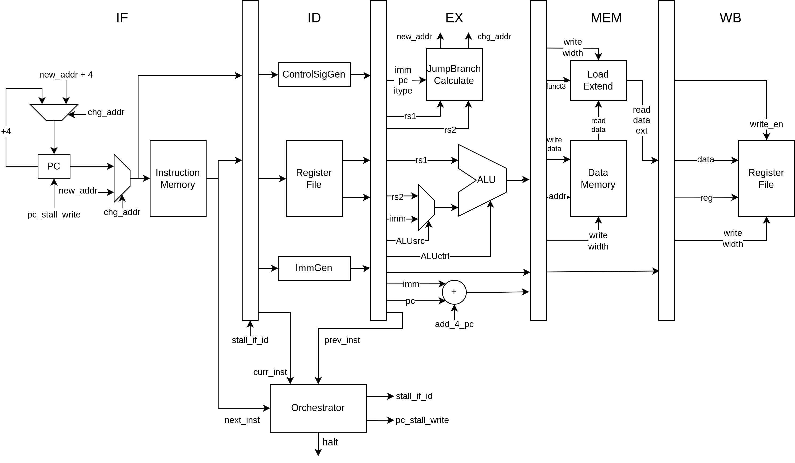

# Project statement

Within this project, student perform research and FPGA implementation of a RISC processing core
based on RISC-V ISA. From the results of implementation, student will perform validation and
performance testing for the core.

Objectives:

- Learn about the RISC-V-based processor model.
- Implementation of the processor using Verilog/SystemVerilog
- Propose validation method, perform validation
- Performance testing for the core through benchmarks

---

Requirements:

- First stage (*current*):
    - Report on the RISC-V processor model
    - Architectural design and implementation of main module
    - Report general method for application/performance benchmark
- Second stage:
    - Complete simulation/validation of implementation
    - Design optimization, other architectural changes/comparisons
    - Compilation and running on Xilinx FPGA
    - Write project report

# About RISC-V

Information taken mostly from [@spec:riscv-isa-unpriv; @spec:riscv-isa-priv]

- RISC-V is an *open standard* with *royalty-free open-source licenses* RISC ISA
- A RISC-V ISA is defined as a base integer ISA, which must be present in any implementation, plus
optional extensions to the base ISA.
    - Currently there are 4 ratified base ISA: `RV32I`, `RV32E`, `RV64I`, `RV64E`
    - Many extensions: multiply/divide, floating point, SIMD, atomic,...
- RISC-V defines three privileges level: User (U), Supervisor (S), Machine (M)
    - Different modes allow program access to different facilities of the processor

# Design decision

:::::::::::::: {.columns align=top .onlytextwidth}

::: {.column width="50%"}

*ISA scope*:

- `RV32I` base instruction set, but skip `FENCE`, `ECALL` and `EBREAK` instruction
- No complete privilege level, only unprivileged instructions
- No exception or trap. Only exception is the invalid instruction exception, which halt execution
and activate a signal
- No memory misaligned access (assumed to never happen)
- Implementation for memory is still undecided, so simulate simple memory for validation

:::

::: {.column width="50%"}

*Architectural*:

- 5-stage pipeline architecture
    - instruction fetch (IF), instruction decode (ID), execution (EX), memory operation (MEM) and
    write back (WB)
- Single-issue, in-order execution
- Simple memory hierarchy (no cache, TLB)
- Some architectures better supports some ISA features. But added hardware complexity means that
most ISA features can't be implemented easily without very involved architecture.

:::

::::::::::::::

# Design detail

---

*Dealing with hazard*:

- Control (branch) hazard resolved by stalling the pipeline for the IF/ID pipeline registers.
Stalling implies freezing the current PC and inserting NOP into the pipeline from IF/ID pipeline
register.

- Data hazard will be resolved by stalling the pipeline for the IF/ID pipeline registers. Stalling
implies freezing the current PC and inserting NOP into the pipeline from IF/ID pipeline register.
Orchestrator will read the current and last 2 command from within the pipeline to determine whether
a stall is necessary. Effectively, there will always be enough inserted NOP between dependent
instruction to not cause hazard.

*Halt*:

- On detection of a invalid instruction, the processor will halt execution and pull halt signal high.

# Validation and benchmark

:::::::::::::: {.columns align=top .onlytextwidth}

::: {.column width="50%"}

*Validation plan*: For now not concrete

- Hand-written test and manual result checking
- Testing against a golden model (maybe Spike)
- RISCOF (uncertain)

:::

::: {.column width="50%"}

*Benchmark plan*: Very little detail, so general idea for now

- Aim to use Dhrystone
- Need to prepare special program
    - Removing all system call (by printing text) from source
    - Insert invalid instruction at the end to trigger halt
- Can do this for simulation and for FPGA implementation
- For running on FPGA, PS loads program and detect halt signal

:::

:::

# Progress and plan

:::::::::::::: {.columns align=top .onlytextwidth}

::: {.column width="50%"}

*Progress*:

- RISC-V processor model (100%): Currently done. Already read enough of the RISC-V specification and
processor model to decide on what to implement.

- Architecture design and implementation (70%): Currently not done. General design has been set. But
implementation is still underway.

- Validation and benchmark strategy (60%): Only much of the validation process has been laid out.
Detail is severely lacking in performance benchmarking.

:::

::: {.column width="50%"}

*Plan*:

1. Finish implementation
2. Perform verification for the design on RTL level
3. Research and laid out a more concrete plan for benchmarking
4. FPGA implementation and running benchmark.
5. Write report

:::

::::::::::::::

# FPGA development board

:::::::::::::: {.columns align=top .onlytextwidth}

::: {.column width="55%"}

*EBAZ4205*:

- Attractive pricing (~1mil VND), used as personal tinkering and learning tool
- Zynq 7010 SoC
- PL will be used to implement design
- PS can help in validation and benchmarking

![Simplified model of the Zynq architecture [@book:the-zynq-book] \label{fig:zynq-model}](image/zynq_simple_model.png){height=25%}

:::

::: {.column width="45%"}

{height=75%}

:::

::::::::::::::

# References
